# Free Prompt Optimizer (MCP)

An [MCP](https://modelcontextprotocol.io) server that rewrites your prompts
using rule-based prompt-engineering best practices — role/audience, context
separation, explicit output format, examples, success criteria, and
step-by-step reasoning for complex tasks.

**It is genuinely free.** There are no LLM calls, no API keys, and no network
requests anywhere in this server — it's pure local string/regex logic. Connect
it once and use it as much as you want with zero extra API credits.

## Tools

- **`optimize_prompt`** — takes a raw prompt, returns a restructured version
  plus a list of what was weak in the original and what was changed. For
  humans: read the text response. For agents/pipelines: read
  `structuredContent` (`optimizedPrompt`, `issuesFound`, `improvementsApplied`,
  `wordCount`) instead of parsing prose.
- **`analyze_prompt`** — diagnostics only, no rewrite. Returns a **pass/fail +
  numeric score (0–100)** in `structuredContent`, so an agentic caller can gate
  on it programmatically (`if (!result.passed) reject()`) instead of parsing
  text. Accepts `assumeDefinedElsewhere` (`role`, `audience`, `output_format`,
  `success_criteria`, `examples`) for agentic pipelines where those are
  already fixed by a system prompt one layer up — pass them and this won't
  false-flag a per-turn task prompt for not repeating them. Also accepts
  `passThreshold` (default 70) to tune how strict the gate is.

## Option A: connect the public remote server (easiest, anyone can use it)

A hosted copy runs on Cloudflare Workers with no login required:

```
https://claude-free-prompt-optimiser.claude-free-prompt-optimiser-worker.workers.dev/mcp
```

In Claude (claude.ai or Desktop): **Settings → Connectors → Add custom
connector**, paste that URL, and save. See [worker/README.md](worker/README.md)
if you'd rather deploy your own copy (also free).

## Option B: run it locally (stdio)

```bash
git clone https://github.com/SanjayK042016/claude-free-prompt-optimiser.git
cd claude-free-prompt-optimiser
npm install
npm run build
```

### Connect to Claude Code

Add to your MCP config (e.g. via `claude mcp add`, or directly in your
`.claude.json` / `mcp_servers` config):

```json
{
  "mcpServers": {
    "free-prompt-optimizer": {
      "command": "node",
      "args": ["/absolute/path/to/claude-free-prompt-optimiser/dist/index.js"]
    }
  }
}
```

### Connect to Claude Desktop

Add the same block to your `claude_desktop_config.json` under `mcpServers`,
then restart Claude Desktop.

## How the rewrite works

The optimizer checks the prompt for common gaps (missing role, missing output
format, missing examples, vague language, bundled multi-step asks, missing
success criteria, negative-only constraints) and restructures it into tagged
sections (`<task>`, `<context>`, `<output_format>`, etc.) that Claude's own
prompting guide recommends. Anything it can't infer — like your actual
audience or desired format — is left as an explicit `[SPECIFY: ...]`
placeholder so you fill in the real answer instead of getting a guess.

## Using it from an agentic pipeline

Call `analyze_prompt` as a pre-flight guardrail before your agent's task
prompt reaches the model — no LLM round-trip, so it's cheap even in a tight
loop:

```json
// request
{
  "prompt": "Reply to this customer's complaint about a late delivery.",
  "assumeDefinedElsewhere": ["role", "audience", "output_format"],
  "passThreshold": 70
}
```

```json
// response.structuredContent
{
  "passed": true,
  "score": 76,
  "issues": [
    { "id": "no_examples", "severity": "medium", "message": "..." },
    { "id": "no_success_criteria", "severity": "medium", "message": "..." }
  ],
  "assumedElsewhere": ["role", "audience", "output_format"]
}
```

Your orchestrator branches on `passed`/`score` directly — no string parsing.
Without `assumeDefinedElsewhere` the same prompt scores 41/100 and fails,
because in isolation it really is missing role/audience/format; declaring
what your system prompt already guarantees is what makes the check accurate
for a per-turn task prompt instead of a full standalone one.

## Privacy Policy

This connector collects no data of any kind.

- **Data collection**: None. The server does not log, store, or transmit prompt
  content anywhere. Each request is processed in memory and discarded.
- **Usage and storage**: No database, no analytics, no third-party services.
  The Cloudflare Workers instance is stateless — nothing persists between requests.
- **Third-party sharing**: None. There are no outbound network calls in this
  server's code, so your prompts never leave the request/response cycle.
- **Data retention**: N/A — nothing is retained.
- **Contact**: open an issue at
  [github.com/SanjayK042016/claude-free-prompt-optimiser/issues](https://github.com/SanjayK042016/claude-free-prompt-optimiser/issues).

## How this was built

```mermaid
flowchart TD
    A["Idea: MCP tool that optimizes prompts<br/>for free, no extra credits"] --> B{"Optimization method?"}
    B -->|chosen: rule-based heuristics| C["Zero LLM calls · zero API keys<br/>pure regex/string logic"]
    C --> D{"Language / runtime?"}
    D -->|chosen: TypeScript + Node| E["npm init + @modelcontextprotocol/sdk"]

    subgraph P1["Local stdio MCP server"]
        E --> F["heuristics.ts<br/>analyzePrompt + optimizePrompt"]
        F --> G["index.ts<br/>registerTool: optimize_prompt, analyze_prompt"]
        G --> H["Smoke-tested over real stdio<br/>MCP protocol with a live client"]
        H --> I["Pushed to GitHub<br/>claude-free-prompt-optimiser"]
        I --> J["claude mcp add --scope user<br/>works in every local Claude Code session"]
    end

    J --> K{"Goal: anyone connects<br/>via URL, no install"}
    K -->|stdio only runs locally| L["Need a remote HTTP server instead"]

    subgraph P2["Public remote connector"]
        L --> M["Scaffolded Cloudflare's official<br/>remote-mcp-authless template"]
        M --> N["Ported heuristics into worker<br/>createMcpHandler + McpServer v2"]
        N --> O["Verified locally: wrangler dev<br/>+ a real Streamable HTTP client"]
        O --> P["wrangler login &rarr; wrangler deploy"]
        P --> Q["Live public URL on *.workers.dev/mcp"]
        Q --> R["Re-verified end-to-end<br/>over the public internet"]
    end

    subgraph P3["Polish for discoverability"]
        R --> S["Added tool annotations<br/>readOnlyHint / destructiveHint"]
        S --> T["Added Privacy Policy section<br/>— zero data collected"]
        T --> U["Directory-submission ready,<br/>blocked on Team/Enterprise org"]
    end

    U --> V{"Question: does this fit<br/>agentic pipelines too?"}
    V -->|prose output only usable by humans| W["Gap: no structured output,<br/>no system-prompt awareness"]

    subgraph P4["Agent-facing transformation"]
        W --> X["Added validatePrompt: pass/fail<br/>+ numeric score, not just prose"]
        X --> Y["Added assumeDefinedElsewhere<br/>— avoids false positives when role/format<br/>already live in a system prompt"]
        Y --> Z["Added outputSchema + structuredContent<br/>to both tools for machine consumption"]
        Z --> AA["Re-verified locally and in prod:<br/>same prompt goes 41&#8594;76 score<br/>once context is declared"]
    end

    classDef decision fill:#fff3cd,stroke:#856404,color:#665200;
    class B,D,K,V decision;
```



## Development

```bash
npm run dev    # tsc --watch
npm run build  # one-off compile to dist/
npm start      # run the compiled server over stdio
```

## License

MIT
